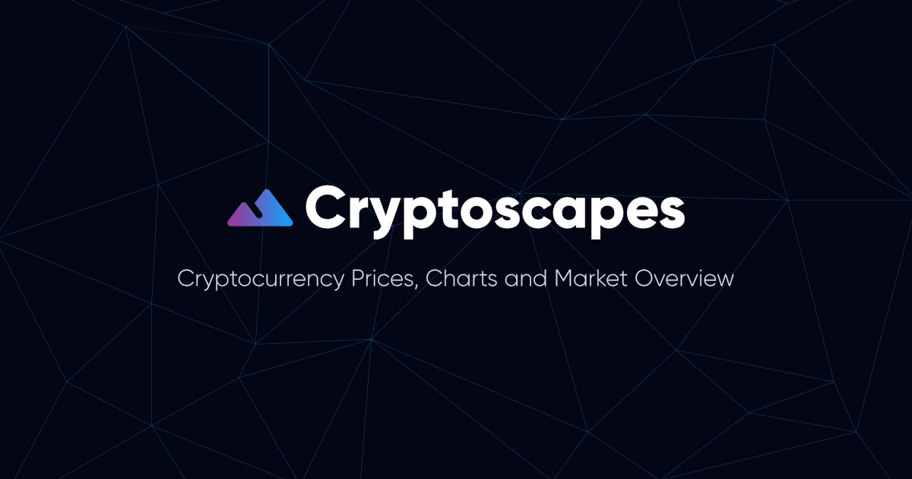

[][1]

## ⭐  About
Cryptoscapes started out from a few skills I wanted to learn and practice over my summer break from college, the state management library [Redux][2], [atomic design][3], and project management.

After tinkering with a bunch of cryptocurrency data with Redux, I eventually decided to create a simple UI to display this data, through the use of charts and graphs in a clean dashboard. Certain visualisations such as a heatmap displaying metric correlations between cryptocurrencies, also involve further manipulation of the data.

The result was Cryptoscapes, an information dashboard that displays prices, trends, status updates, market snapshots and much more. 

## 🛠️  Key Technologies
This project was deployed on AWS and built using:

- React
- Redux
- TypeScript
- Material-UI

## 📝  Data Sources
The information and data used in Cryptoscapes is provided kindly by the following sources:

- [CoinGecko][5]
- [ETH Gas Station][6]
- [Alternative.me][7]
- [Blockchain.com][8]

[1]: https://cryptoscapes.org
[2]: https://https://redux.js.org/
[3]: https://atomicdesign.bradfrost.com/chapter-2/#:~:text=Atomic%20design%20is%20atoms%2C%20molecules,parts%20at%20the%20same%20time.
[4]: https://cryptoscapes.org/trends
[5]: https://www.coingecko.com/
[6]: https://ethgasstation.info/
[7]: https://alternative.me/
[8]: https://www.blockchain.com/